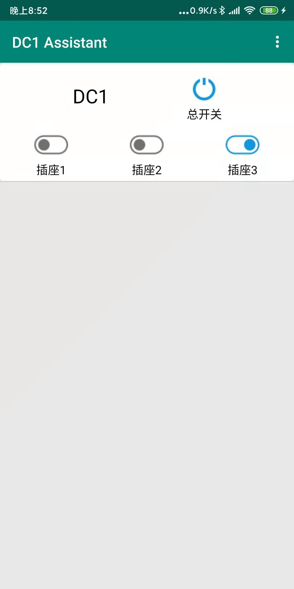
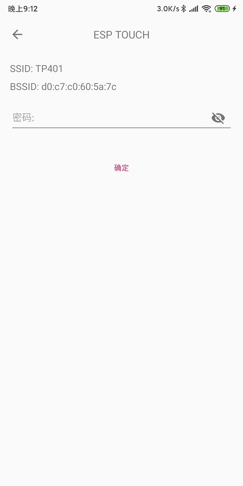
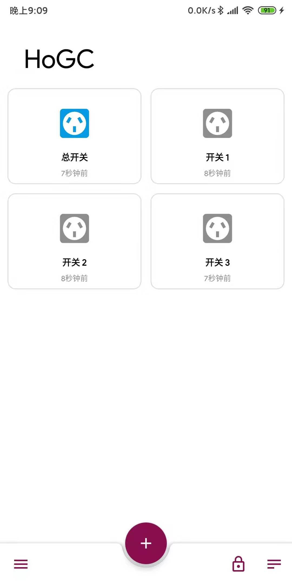
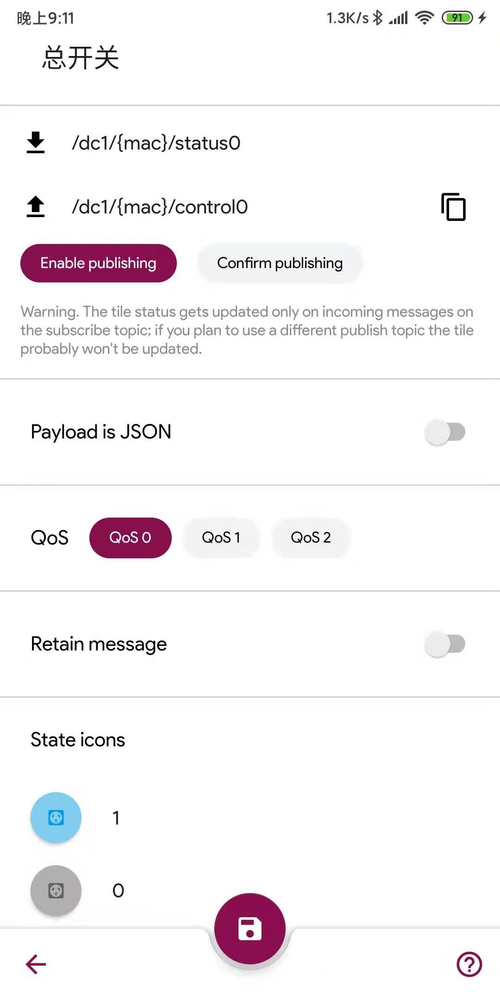
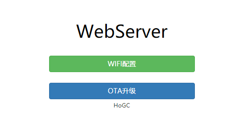
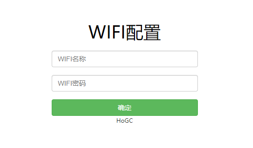
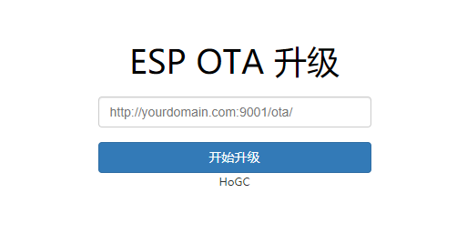

# ESP8266_MQTT_DC1
## 将斐讯DC1排插接入MQTT服务器

斐讯DC1智能排插，由于某些原因斐讯公司的服务器已经关闭，官方app已经无法再使用。排插失去远程控制的功能，所以价格也沦为普通排插的价格。但是可以通过自主搭建MQTT服务器实现远程控制。

1. 低成本(40RMB)
2. 可添加定时任务
3. 可在线升级（OTA）
3. 可查看电压、电流、功率
4. 改造现成插座，简单，美观
5. 间接有了智能台灯、智能风扇......

 

### APP
#### DC1 Assistant
1. 支持ESPTOUCH配网
2. 一键添加
3. 仅支持DC1设备

 
 

#### DC1 Assistant
1. 不支持ESPTOUCH配网
2. 手动一个一个添加
3. 支持所有MQTT设备

 
 

### 使用方法
1. 搭建MQTT服务器
3. clone 项目
3. 修改 mqtt_config.h文件
    - `MQTT_HOST`MQTT服务器域名或IP
    - `MQTT_PORT`MQTT服务器端口号
    - `MQTT_USER`MQTT用户名
    - `MQTT_PASS`MQTT密码
4. 修改 Makefile 文件
    * 芯片型号带B为8Mbit  `SPI_SIZE_MAP?=2`
    * 芯片型号不带B为16Mbit  `SPI_SIZE_MAP?=5`
    *  
5. [拆解DC1排插](https://github.com/HoGC/phicomm_dc1-esphome/tree/master/cookbook)取出控制板
6. [编译下载](https://wiki.ai-thinker.com/esp8266)
    * 使用USB转TTL下载
    * 下载前请先拉低IO0(按下白色按键)
    *  
7. 重新上电LED慢闪即固件刷入成功
8. 将控制板安装回插排中(请将后盖盖好再插上电源)
9. 长按总开关WIFI信号灯快闪进入配网模式
10. 进行配网（ESPTouch、Airkiss）

### 使用说明
1. 任意开关打开都会触发总开关
2. USB的开关随总开关的状态
3. LOGO灯即是总开关和USB的状态
6. WIFI信号灯慢闪即正在连接WIFI
7. WIFI信号灯快闪即进入配网模式
8. WIFI信号灯常亮即成功连接WIFI 
7. 长按总开关进入配网模式，用于重新配网
8. 每次配网自动保存，可共存两个WIFI信息
9. 长按开关1，进入Webserver配置模式
10. 定时任务使用MQTT消息添加

### 话题说明

1. 定义文件mqtt_config.h
2. `{mac}`即芯片的MAC
3. 状态话题：`/dc1/{mac}/status{0-3}`
4. 控制话题：`/dc1/{mac}/control{0-3}`
5. 功率信息话题：`/dc1/{mac}/power`
6. 电压信息话题：`/dc1/{mac}/voltage`
7. 电流信息话题：`/dc1/{mac}/current`
8. 遗嘱话题：`/dc1/lwt/{mac}`
9. 出生话题：`/dc1/birth/{mac}`
10. ota升级话题：`/dc1/ota/{mac}`
11. 定时任务配置话题：`/dc1/{mac}/timer/config`
12. 定时任务配置输出信息话题：`/dc1/{mac}/timer/info`

### 定时任务配置    
1. 添加定时任务 
    ```
    //时间：17:45, 重复周期: 周一到周六, 关闭开关1  
    {
        "addTimer": {
            "time": "17:45",
            "week": "1111110",
            "switchNum": 1,
            "value": 0
        }
    }
    ```    
    ```
    //时间：12:45, 重复周期: 今天, 打开开关1  
    {
        "addTimer": {
            "time": "12:45",
            "week": "today",
            "switchNum": 1,
            "value": 1
        }
    }
    ```
2. 获取定时任务信息
    ```
    {
        "getTimer": 0
    }
    ```
    ```
    //返回(定时任务配置输出信息话题)
    //taskId为操作 202 为关闭开关1
    {
        "timerNum": 2,
        "timerInfo": [
            {
                "id": 1000,
                "status": 1,
                "time": "17:45:00",
                "week": "1111110",
                "taskId": 202
            },
            {
                "id": 1001,
                "status": 1,
                "time": "12:45:00",
                "week": "today",
                "taskId": 203
            }
        ]
    }
    ```    
3. 删除定时任务(id)
    ```
    {
        "delTimer": 1001
    }
    ```

### OAT升级说明

* 使用ota升级话题发送升级文件获取地址
* 消息格式`{"url":"http://yourdomain.com:9001/ota/"}`    


### Webserver说明
1. 长按开关1按键进入Webserver配置模式，wifi灯闪动    
2. 使用手机或电脑连接名称为 Webserver 的热点
3. 访问192.168.4.1

* 主界面
*  

* WIFI配置界面    
*

* OTA升级界面
* 


### 其他平台
* [机智云平台](https://github.com/HoGC/ESP8266_Gizwits_DC1)
* [阿里云生活物联网平台](https://github.com/HoGC/esp-aliyun-dc1)